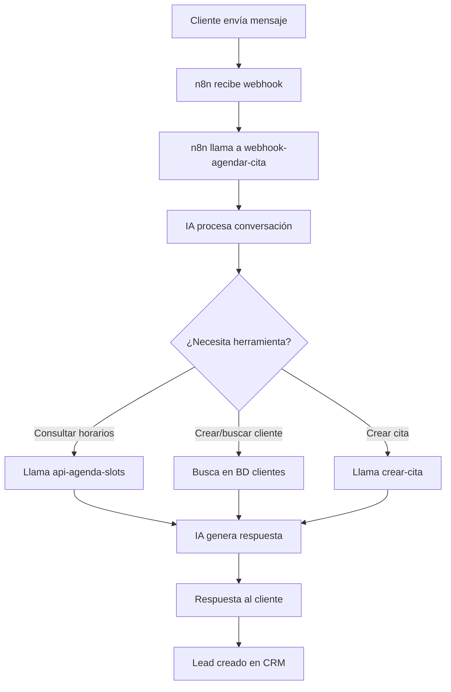

# 📅 Sistema de Agendamiento Automático

Sistema completo para agendar citas automáticamente a través de mensajes de WhatsApp/Facebook Messenger usando n8n y webhooks con IA conversacional.

## 🎯 Visión General

El sistema permite a los clientes agendar citas mediante conversaciones naturales por WhatsApp/Facebook. La IA entiende la intención del cliente, consulta disponibilidad, registra datos y confirma la cita automáticamente.

## 🔄 Flujo del Sistema



## 🔐 Autenticación

Todas las APIs requieren autenticación mediante header:
```
x-api-key: clinic_api_key_2025_n8n_integration
```

## 📡 Endpoints API Disponibles

### 1. Webhook Principal de Agendamiento

**Endpoint:** `POST /functions/v1/webhook-agendar-cita`

**Descripción:** Punto de entrada principal que recibe mensajes y maneja la conversación completa con IA.

**Request Body:**
```json
{
  "message": "Hola, quiero agendar una cita",
  "text": "Hola, quiero agendar una cita",
  "Body": "Hola, quiero agendar una cita",
  "from": "+5213341234567",
  "From": "+5213341234567",
  "phone": "+5213341234567",
  "channel": "whatsapp"
}
```

**Response:**
```json
{
  "success": true,
  "reply": "¡Hola! Con gusto te ayudo a agendar tu cita. ¿Qué servicio te interesa?",
  "messaging_product": "whatsapp",
  "to": "+5213341234567",
  "text": {
    "body": "¡Hola! Con gusto te ayudo a agendar tu cita. ¿Qué servicio te interesa?"
  }
}
```

**Headers:**
```
Content-Type: application/json
x-api-key: clinic_api_key_2025_n8n_integration
```

---

### 2. Consultar Slots Disponibles

**Endpoint:** `GET /functions/v1/api-agenda-slots`

**Descripción:** Obtiene horarios disponibles según filtros.

**Query Parameters:**
- `fecha_desde` (requerido): Fecha inicio en formato YYYY-MM-DD
- `fecha_hasta` (requerido): Fecha fin en formato YYYY-MM-DD
- `doctor_id` (opcional): ID del profesional
- `sucursal_id` (opcional): ID de la sucursal
- `servicio_id` (opcional): ID del servicio

**Ejemplo:**
```
GET /functions/v1/api-agenda-slots?fecha_desde=2025-01-20&fecha_hasta=2025-01-22&sucursal_id=1
```

**Response:**
```json
{
  "slots": [
    {
      "fecha": "2025-01-20",
      "hora_inicio": "09:00",
      "duracion_minutos": 60,
      "disponible": true
    },
    {
      "fecha": "2025-01-20",
      "hora_inicio": "09:30",
      "duracion_minutos": 60,
      "disponible": true
    }
  ],
  "total": 2
}
```

---

### 3. Crear Cita

**Endpoint:** `POST /functions/v1/crear-cita`

**Request Body:**
```json
{
  "id_cliente": 123,
  "id_empleado": 5,
  "id_servicio": 8,
  "id_sucursal": 1,
  "fecha": "2025-01-20",
  "hora_inicio": "14:00:00",
  "duracion_minutos": 60
}
```

**Response:**
```json
{
  "cita": {
    "id": 456,
    "id_cliente": 123,
    "id_empleado": 5,
    "id_servicio": 8,
    "fecha": "2025-01-20",
    "hora_inicio": "14:00:00",
    "hora_fin": "15:00:00",
    "estado": "reservada",
    "created_at": "2025-01-15T10:30:00Z"
  }
}
```

---

### 4. Gestión de Leads CRM

**Endpoint:** `POST /functions/v1/api-crm-leads`

**Descripción:** Crea un lead en el CRM cuando se agenda una cita.

**Request Body:**
```json
{
  "nombre": "Juan Pérez",
  "telefono": "+5213341234567",
  "email": "juan@email.com",
  "canal_origen": "whatsapp",
  "pipeline_stage": "cita_agendada",
  "cita_id": 456
}
```

**Response:**
```json
{
  "id": 789,
  "nombre": "Juan Pérez",
  "telefono": "+5213341234567",
  "email": "juan@email.com",
  "canal_origen": "whatsapp",
  "pipeline_stage": "cita_agendada",
  "cita_id": 456,
  "created_at": "2025-01-15T10:30:00Z"
}
```

---

## 🤖 Configuración de IA

El webhook utiliza **Lovable AI** con el modelo `google/gemini-2.5-flash` y tiene las siguientes herramientas:

### Herramienta 1: consultar_horarios_disponibles
```json
{
  "name": "consultar_horarios_disponibles",
  "description": "Consulta los horarios disponibles para una fecha específica",
  "parameters": {
    "fecha": "YYYY-MM-DD",
    "id_servicio": "número (opcional)"
  }
}
```

### Herramienta 2: buscar_o_crear_cliente
```json
{
  "name": "buscar_o_crear_cliente",
  "description": "Busca un cliente existente o crea uno nuevo",
  "parameters": {
    "nombre": "string (requerido)",
    "telefono": "string (requerido)",
    "email": "string (opcional)"
  }
}
```

### Herramienta 3: crear_cita
```json
{
  "name": "crear_cita",
  "description": "Crea una nueva cita en el sistema",
  "parameters": {
    "id_cliente": "número",
    "id_empleado": "número",
    "id_servicio": "número",
    "fecha": "YYYY-MM-DD",
    "hora_inicio": "HH:MM:SS",
    "duracion_minutos": "número"
  }
}
```

---

## 🔧 Configuración en n8n

### Paso 1: Webhook de Entrada

1. **Nodo:** Webhook
2. **Método HTTP:** POST
3. **Path:** `/webhook/whatsapp` (o tu preferencia)
4. **Responder:** Immediately
5. **Response Data:** All Entries

### Paso 2: Procesar Mensaje de WhatsApp

**Nodo:** Function o Code

```javascript
// Extraer datos del mensaje de WhatsApp
const mensaje = $input.item.json.Body || $input.item.json.text || "";
const telefono = $input.item.json.From || $input.item.json.from || "";

return {
  mensaje: mensaje,
  telefono: telefono,
  canal: "whatsapp"
};
```

### Paso 3: Llamar al Webhook de Agendamiento

**Nodo:** HTTP Request

- **Método:** POST
- **URL:** `https://ckiwuneigsdotfwrxmbu.supabase.co/functions/v1/webhook-agendar-cita`
- **Headers:**
  ```json
  {
    "Content-Type": "application/json",
    "x-api-key": "clinic_api_key_2025_n8n_integration"
  }
  ```
- **Body:**
  ```json
  {
    "message": "={{ $json.mensaje }}",
    "from": "={{ $json.telefono }}",
    "channel": "={{ $json.canal }}"
  }
  ```

### Paso 4: Responder a WhatsApp

**Nodo:** HTTP Request (API de WhatsApp Business)

- **Método:** POST
- **URL:** `https://graph.facebook.com/v17.0/TU_PHONE_ID/messages`
- **Headers:**
  ```json
  {
    "Authorization": "Bearer TU_TOKEN_WHATSAPP",
    "Content-Type": "application/json"
  }
  ```
- **Body:**
  ```json
  {
    "messaging_product": "whatsapp",
    "recipient_type": "individual",
    "to": "={{ $('Procesar Mensaje').item.json.telefono }}",
    "type": "text",
    "text": {
      "body": "={{ $json.reply }}"
    }
  }
  ```

---

## 📋 Ejemplo de Flujo Completo n8n

```
┌─────────────────┐
│  Webhook        │ ← Recibe mensaje de WhatsApp
│  (Trigger)      │
└────────┬────────┘
         │
         ▼
┌─────────────────┐
│  Function       │ ← Extrae mensaje y teléfono
│  (Procesar)     │
└────────┬────────┘
         │
         ▼
┌─────────────────┐
│  HTTP Request   │ ← POST a webhook-agendar-cita
│  (IA Backend)   │
└────────┬────────┘
         │
         ▼
┌─────────────────┐
│  HTTP Request   │ ← Envía respuesta a WhatsApp
│  (WhatsApp API) │
└─────────────────┘
```

---

## 💬 Ejemplo de Conversación

### Cliente → Sistema
```
Cliente: "Hola, quiero una cita"
```

### Sistema → Cliente
```
IA: "¡Hola! Con gusto te ayudo. Nuestros servicios son:
- Facial (60 min)
- Masaje (90 min)
- Limpieza Facial (45 min)
- Tratamiento Corporal (120 min)

¿Cuál te interesa?"
```

### Cliente → Sistema
```
Cliente: "Quiero un masaje para el viernes"
```

### Sistema (ejecuta herramienta: consultar_horarios_disponibles)
```
IA llama internamente a:
GET /api-agenda-slots?fecha_desde=2025-01-24&fecha_hasta=2025-01-24&id_servicio=2
```

### Sistema → Cliente
```
IA: "Perfecto, tenemos disponibilidad el viernes 24 de enero:
- 10:00 AM
- 2:00 PM
- 4:30 PM

¿Cuál prefieres?"
```

### Cliente → Sistema
```
Cliente: "A las 2pm. Soy María González, mi correo es maria@email.com"
```

### Sistema (ejecuta herramientas)
```
1. buscar_o_crear_cliente: Crea cliente con datos
2. crear_cita: Agenda la cita
3. Crea lead en CRM automáticamente
```

### Sistema → Cliente
```
IA: "✅ ¡Listo María! Tu cita está confirmada:

📅 Viernes 24 de enero
⏰ 2:00 PM
💆 Masaje (90 min)

Te enviaremos un recordatorio. ¡Nos vemos pronto!"
```

---

## 🔒 Seguridad

### API Key
- Todas las peticiones deben incluir: `x-api-key: clinic_api_key_2025_n8n_integration`
- Rotar la API key periódicamente en producción
- No exponer la API key en el código frontend

### CORS
- Todas las funciones tienen CORS habilitado con `Access-Control-Allow-Origin: *`
- En producción, restringir a dominios específicos

### Validación
- Todos los endpoints validan datos requeridos
- Los teléfonos se normalizan automáticamente
- Los slots se validan contra disponibilidad real

---

## 📊 Datos Persistidos

### Tabla: conversaciones_agendamiento
```sql
{
  "id": "uuid",
  "telefono": "string",
  "canal": "whatsapp | facebook",
  "estado": {
    "stage": "inicial | consultando_horario | confirmando_datos | creando_cita | finalizado",
    "nombre": "string",
    "telefono": "string",
    "email": "string",
    "fecha_deseada": "YYYY-MM-DD",
    "hora_deseada": "HH:MM",
    "id_cliente": "number",
    "id_servicio": "number",
    "slots_disponibles": []
  },
  "ultimo_mensaje": "string",
  "ultima_respuesta": "string",
  "created_at": "timestamp",
  "updated_at": "timestamp"
}
```

### Tabla: leads
```sql
{
  "id": "number",
  "nombre": "string",
  "telefono": "string",
  "email": "string",
  "canal_origen": "whatsapp | facebook | web",
  "pipeline_stage": "lead_nuevo | contactado | cita_agendada | cliente",
  "cita_id": "number (FK a agendas)",
  "created_at": "timestamp"
}
```

---

## 🧪 Testing

### Probar el webhook directamente con curl:

```bash
curl -X POST https://ckiwuneigsdotfwrxmbu.supabase.co/functions/v1/webhook-agendar-cita \
  -H "Content-Type: application/json" \
  -H "x-api-key: clinic_api_key_2025_n8n_integration" \
  -d '{
    "message": "Hola quiero agendar",
    "from": "+5213341234567",
    "channel": "whatsapp"
  }'
```

### Probar consulta de slots:

```bash
curl "https://ckiwuneigsdotfwrxmbu.supabase.co/functions/v1/api-agenda-slots?fecha_desde=2025-01-20&fecha_hasta=2025-01-22&sucursal_id=1" \
  -H "x-api-key: clinic_api_key_2025_n8n_integration"
```

---

## 📝 Notas Importantes

1. **Horarios de Atención**: Configurados de 9:00 AM a 8:00 PM, Lunes a Viernes y Sábados 9:00 AM a 2:00 PM
2. **Slots cada 30 minutos**: El sistema genera slots cada media hora
3. **Estado Inicial**: Todas las citas se crean con estado `reservada`
4. **Lead Automático**: Se crea un lead en CRM cuando se confirma una cita
5. **Conversaciones Persistidas**: El estado se guarda entre mensajes del mismo teléfono

---

## 🚀 Próximos Pasos

1. ✅ Backend API listo
2. ✅ Webhook con IA conversacional implementado
3. ⏳ Crear tabla `conversaciones_agendamiento` (pendiente aprobación)
4. ⏳ Configurar n8n con los nodos descritos
5. ⏳ Configurar WhatsApp Business API
6. ⏳ Pruebas end-to-end

---

## 📞 Soporte

Para dudas sobre la implementación, consulta la documentación de cada componente o revisa los logs en Lovable Cloud → Edge Functions.
